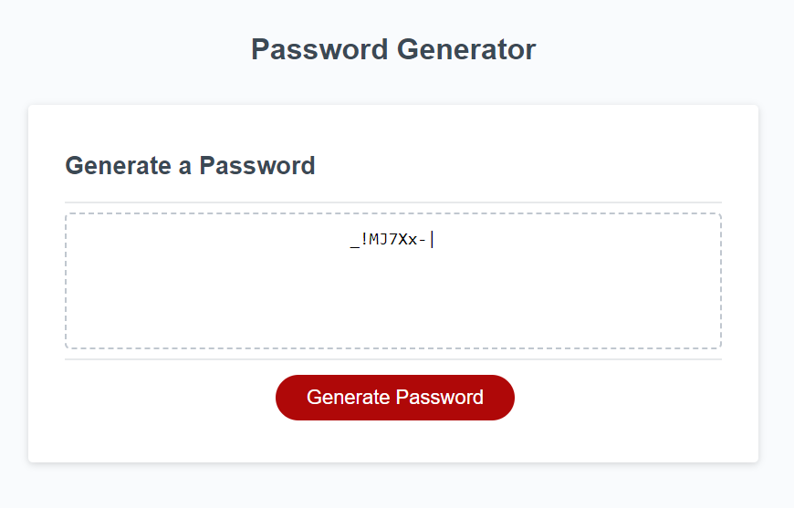

# Random Password Generator
## Description

This application will generate a random password based on user preferences, such as number of characters and types of characters that will be included in the generated password

## Installation

N/A

## Usage

Users can interact with this web app to create a randomly generated password so that they can protect their login credentials from being guessed by bad actors. When clicking the Generate Password button, users will then be prompted to say how long they want their password to be. This will be a number between 8 and 128. After establishing the character length, users will be prompted to confirm which character types they want included in the password. The character types are Capital Letters, Lower Case Letters, Numbers, and Special Characters. After answering these prompts, the app will display the newly generated password for the user to copy and paste to their desired destination.  

## Credits

Starter code with HTML and CSS courtsey of BCS Unit 3, JavaScript. Guidance from office hours instruction by Rebecca Goldstein and Toacin Patwary, and tutor Jehyun Jung.

## License

N/A